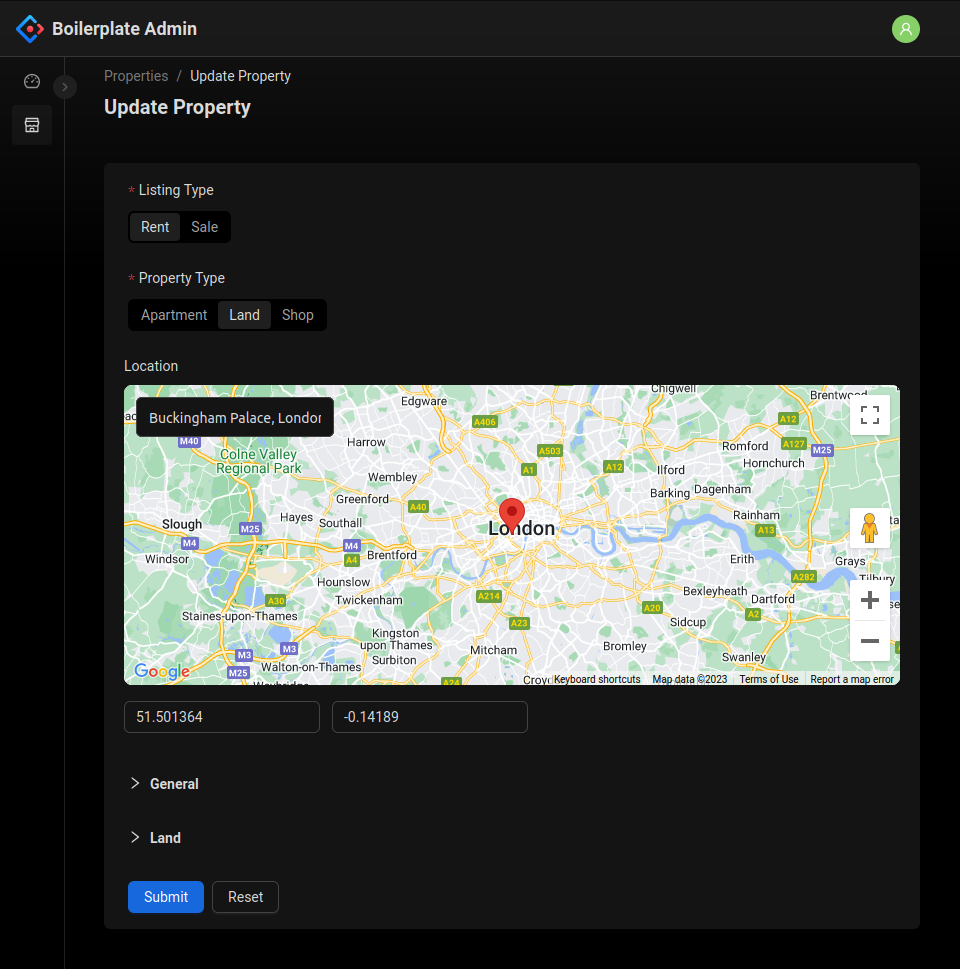
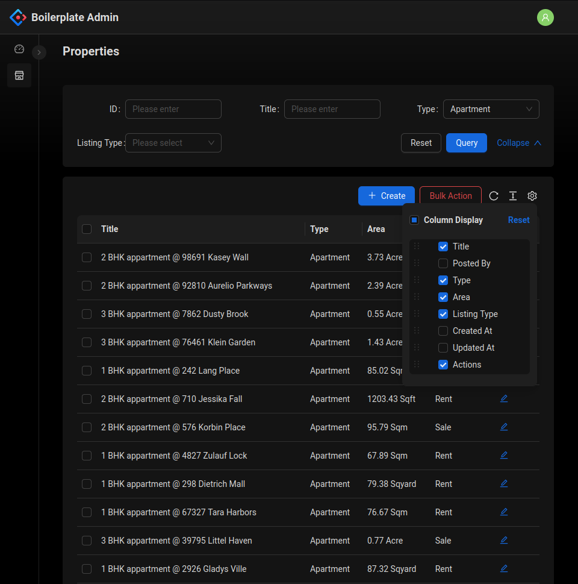

# NestJS, Antd Boilerplate. 🚀

A starter project that uses the powerful combination of NestJS and Ant Design Pro Components. With NestJS as the foundation, this boilerplate empowers you to build robust APIs using TypeScript. Along with the feature-rich Ant Design Pro Components, that lets you rapidly create data tables and complex forms, accelerating your development process. 




## Backend Features
The backend of this boilerplate provides essential functionalities such as role-based authentication, data validation, data serialization with Data Transfer Objects (DTOs), database migrations, seeding, and various helper utilities. It also includes an example module that demonstrates how to leverage these features effectively.

### Authentication
- Role based authentication with `Admin` and `User` roles.
- `@Auth([UserRole.Admin])` decorator to specify access roles for specific endpoints.
- `@AuthUser` decorator to retrieve the currently authenticated user.
- Support for optional authentication for certain endpoints.

### Database Migration & Seeding
- Shared configuration between TypeORM CLI and NestJS.
- Factories and seeders for populating the database.
- Convenient scripts like `migration:generate`, `migration:run`, `migration:revert`, `schema:drop`, `seed:run`, `db:setup`.

### DTOs & Validation
- Separation of concerns between database entities and response using Data Transfer Objects (DTOs).
- Validation of data using the class-validator library.

### Others
- `PaginatedRequest` and `PaginatedResponse` types compatible with Ant Design Pro components.
- VSCode settings to enforce relative imports.
- An example module named `properties` that showcases the usage of all the aforementioned features.
- Custom configuration files.

## Frontend

### Auth
- `reactive-auth-store` for managing authentication state and tokens.
- Synchronization of authentication state across multiple tabs.
- Access to authentication state outside of React components.
- `Guest` and `Protected` components for handling guest and authorized access.
- `useAuthUser` hook for retrieving the authenticated user.

### Axios Client
- Interceptors to attach access tokens and automatically refresh them before expiration.
- Custom `requiresAuth` property added to Axios config, enabling authentication requirements to be specified per route, and default authentication requirement for all routes.

### Quick CRUD
- Unlike `@ant-design/pro-components`, this boilerplate works seamlessly with React Router DOM.
- Complete data table functionality with pagination, filtering, and bulk actions with just a few lines of code.
- Easily add forms with features such as dependent fields, data validation, and maps.
- Custom form field for latitude and longitude.
- Custom search field that supports remote data and pre-filled values.

## Quick Start

### Backend

Navigate to api directory 
```
cd ./api
```

Install dependencies
```
yarn
```

Copy env file
```
cp ./.env.example ./.env
```

Update configuration in `.env` file
```
DB_HOST=localhost
DB_PORT=3306
DB_USERNAME=root
DB_PASSWORD=password
DB_DATABASE=nest_antdpro_crud_boilerplate
AUTH_JWT_SECRET=asdfasfasdfdasff
CORS_ORIGINS=http://localhost:3001
```

Setup database. This will drop all tables and the run migrations and seeders. 
```
yarn db:setup
```

Start dev server
```
yarn start:dev
```

### Admin

Navigate to admin directory 
```
cd ./admin
```
Install dependencies
```
yarn
```

Copy env file
```
cp ./.env.example ./.env
```

Update configuration in `.env` file. React maps key if for maps input.
```
PORT=3001
REACT_APP_API_BASE_URL=http://localhost:3000
REACT_APP_MAPS_KEY=
```

Start server
```
yarn start
```

### Try
- Navigate to localhost:3001.
- Login with username: `admin@admin.com` & password: `password`.
- From the sidebar navigate to `properties`.

## Todo
- Add Usage Docs
- Custom expections classes in backend and error handing in frontend.
- Swagger
- Single & multiple image input.
- Ckeditor input
- Console Commands
- Mailer
- Docker